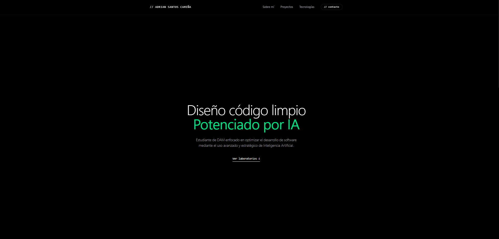

# 🌐 Personal Portfolio — Software Developer

¡Buenas! Soy desarrollador de aplicaciones enfocado en la creación de soluciones de software robustas, eficientes y con un diseño de interfaz extremadamente cuidado, este espacio web está diseñado para mostrar mis proyectos de DAM, mi stack tecnológico y mi evolución en el sector.

---

## 👨‍💻 Sobre mí & Filosofía de Desarrollo

No me limito solo a picar código para que las cosas funcionen; me obsesiona la arquitectura que hay detrás, la optimización de los sistemas y conseguir una experiencia de usuario (UI/UX) limpia, fluida y sin fricciones, me muevo con soltura tanto en el desarrollo de lógica de negocio como en el despliegue de entornos controlados.

Actualmente estoy centrado en perfeccionar el desarrollo nativo y la integración eficiente de servicios de inteligencia artificial en herramientas cotidianas, buscando siempre que el producto final sea impecable visual y técnicamente.

---

## 🛠️ Stack Tecnológico

Mi caja de herramientas se compone de tecnologías estables y potentes que me permiten afrontar proyectos tanto web como de escritorio y sistemas:

- **Languages:** JavaScript (ES6+), XML, Kotlin.
- **Tools & DevOps:** Docker, Git / GitHub.
- **Especialidades:** Diseño de interfaces adaptativas sin dependencias pesadas, inyección de scripts, optimización de consultas SQL y maquetación geométrica minimalista.

---

## 🚀 Laboratorios Destacados

Aquí tienes una muestra de los desarrollos reales en los que he estado trabajando, aplicando buenas prácticas de programación y diseño responsivo:

### 🏦 1. Simulador de Sistemas de Gestión Bancaria
Desarrollo de un núcleo lógico orientado a objetos para la gestión de transacciones bancarias, control de excepciones personalizadas y persistencia simulada de datos financieros en tiempo real.
- **Tecnologías:** JavaScript, HTML5, CSS3.
- [👉 Abrir Simulador en Vivo](./simulador-bancario.html)

### 🗄️ 2. Optimización y Modelado de Bases de Datos (SQL)
Diseño, normalización y optimización de consultas complejas (Triggers, Funciones y Vistas) aplicadas a un entorno corporativo simulado con consola de ejecución integrada.
- **Tecnologías:** SQL, Tailwind CSS, JavaScript.
- [👉 Abrir Laboratorio SQL en Vivo](./gestion-bbdd.html)

---

## 📫 ¿Hablamos?

Si te mola mi perfil, tienes alguna propuesta o simplemente quieres cotillear el código de mis proyectos de DAM, puedes contactar conmigo a través de mi perfil de GitHub.
